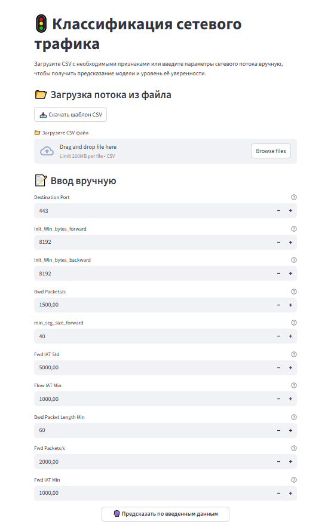

# 🚦 Intrusion Detector
Классификация сетевого трафика с использованием обученной ML-модели.  
Проект включает FastAPI, Streamlit-интерфейс, Docker и тесты с Pytest.

## Возможности
* Предсказания по JSON и CSV
* Обученная модель XGBoost
* Уровень уверенности модели
* Streamlit-интерфейс для визуального ввода
* API на FastAPI
* Docker и docker-compose для запуска



## Стек технологий
* Python 3.10
* XGBoost
* Optuna
* FastAPI
* Streamlit
* Pytest
* Docker
* GitHub Actions

## Обучение модели
Процесс обучения модели и данные, на которых обучалась модель, представлены в **/model_training**

## Запуск проекта c Docker
```
docker-compose up --build
```
FastAPI: http://localhost:8000/docs

Streamlit: http://localhost:8501

## Запуск без Docker
```
pip install -r requirements.txt

uvicorn api:app --reload

streamlit run streamlit_app.py
```
## Недостающие данные

Из-за ограничений GitHub файлы больше 100 MB не хранятся в репозитории, поэтому данные для обучения модели можно скачать по ссылке:<br> (https://drive.google.com/drive/folders/1uv-Wx3qfW4vqgSC404eAXeehfbnKqIGQ?usp=sharing)

После скачивания разместите файл в следующую папку проекта:
* model_training/CIC-IDS2017.csv
